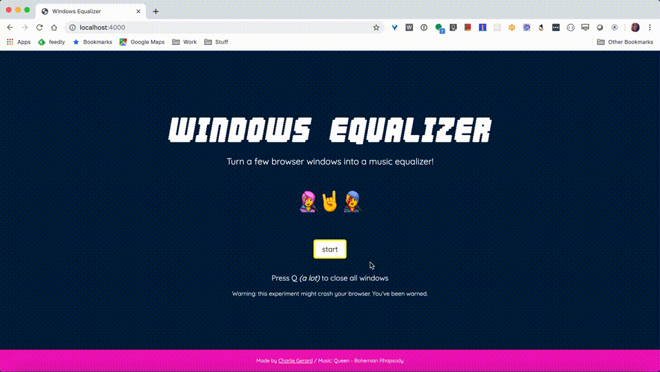

# Music equalizer with browser windows

*Built in a few hours so probably buggy*

Following [this prototype](https://flappy-windows.netlify.com), I decided to play around with the Web Audio API and build a music equalizer with browser windows.

## End result:

## Tech stack:

* HTML
* CSS
* JavaScript
* Web Audio API 🎉

## Good to know:

* It looks a little different on Firefox because Chrome has a minimum width value for popup windows so I calculated the number of windows based on that. It still works on Firefox but there is a space between each popup.

* Quitting doesn't always work when pressing `q` so you might have to do it manually.
